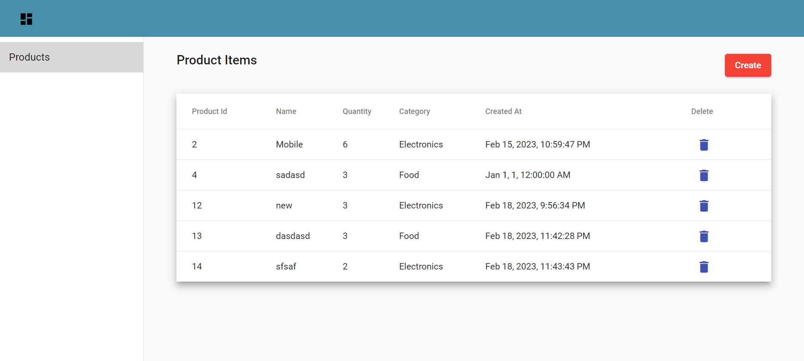

# DevOn.UI

This project was generated with [Angular CLI](https://github.com/angular/angular-cli) version 13.3.0.

## Development server

Run `ng serve` for a dev server. Navigate to `http://localhost:4200/`. The application will automatically reload if you change any of the source files.

## Installing Packages

After cloning the repo please run `npm install` in the project root folder to install all the dependent packages. 

## Code scaffolding

Run `ng generate component component-name` to generate a new component. You can also use `ng generate directive|pipe|service|class|guard|interface|enum|module`.

## Build

Run `ng build` to build the project. The build artifacts will be stored in the `dist/` directory.

## Further help

To get more help on the Angular CLI use `ng help` or go check out the [Angular CLI Overview and Command Reference](https://angular.io/cli) page.

## Screens

Below is the image of form to enter api key. For testing purpose use `4942956-87b1-4816-b8f5-45483fa05201`

Once logged in dashboard with preloaded product list

Click on Create button to add new product.

The category drop down is populated from api as shown below

If we want to delete the product please click delete button as shown below

A popup will be displayed as shown below.Click delete to confirm.

Validation messages will be dispalyed as shown below

Click product link to go back to list as shown below

Any api error the snack bar will be displayed as shown below.

